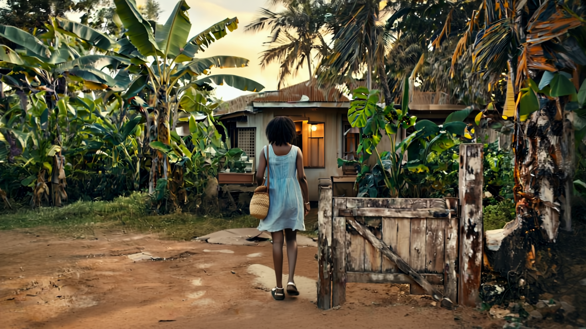

# 🌺 Homecoming Dream  
*A poetic AI-generated short film — made with Runway Gen-4 and narrated through music, not words.*

---

## 🎬 Overview

**Tropical Homecoming Dream** is a short visual story created using AI video generation tools, designed to evoke ancestral memory, softness, and sensory immersion. Inspired by the flora and light of Kwa-Zulu-Natal, South Africa — particularly the *Ficus natalensis* and banana groves in the area — this project uses only music and images to tell its story. No narration. No dialogue.

---

## ✨ Project Highlights

- 🧠 **AI Model**: Runway Gen-4 (Video-to-Video + Prompt-to-Video)
- 🧰 **Tools Used**: RunwayML, Canva, Google Drive
- 🎼 **Soundtrack**: Cinematic ambient music — no spoken words
- 🎥 **Structure**: 5 scenes stitched manually in Canva
- 📷 **Style**: Poetic · Cinematic · Ancestral · Lush · Sensory

---

## 🌿 Scene Breakdown

| Scene | Description |
|-------|-------------|
| **1** | Arrival. A young woman steps off a plane, onto the tarmac. |
| **2** | She rides in a busy minibus taxi to her home. |
| **3** | She walks down a rural path, bathed in tropical light towards her house. |
| **4** | She touches the trunk of an ancestral tree. |
| **5** | She walks barefoot through banana groves, smiling, sunlight filtering through trees. |

---

## 📁 Files

- `/assets/`: Selected stills, references, and thumbnails  
- `tropical_homecoming_dream.mp4`: Final stitched video  
- `README.md`: This file  

---

## 🛠️ Notes on Process

- **Prompt engineering** focused on continuity: same character, mood, and color grading across scenes
- **Error handling**: Several Runway Gen-4 failures resolved by simplifying prompts and using fewer reference frames
- **No narration**: Emotional arc built purely through visuals + instrumental score

---

## 🎞️ Final Video

> 🔗 Watch here: [(https://youtu.be/TKTmcGKM6l4)] 

---

## 🪷 Inspiration

This project was born from a memory — the slow joy of returning home, barefoot, sun-drenched, and quiet.

> “The air is still, warm, alive.”  
